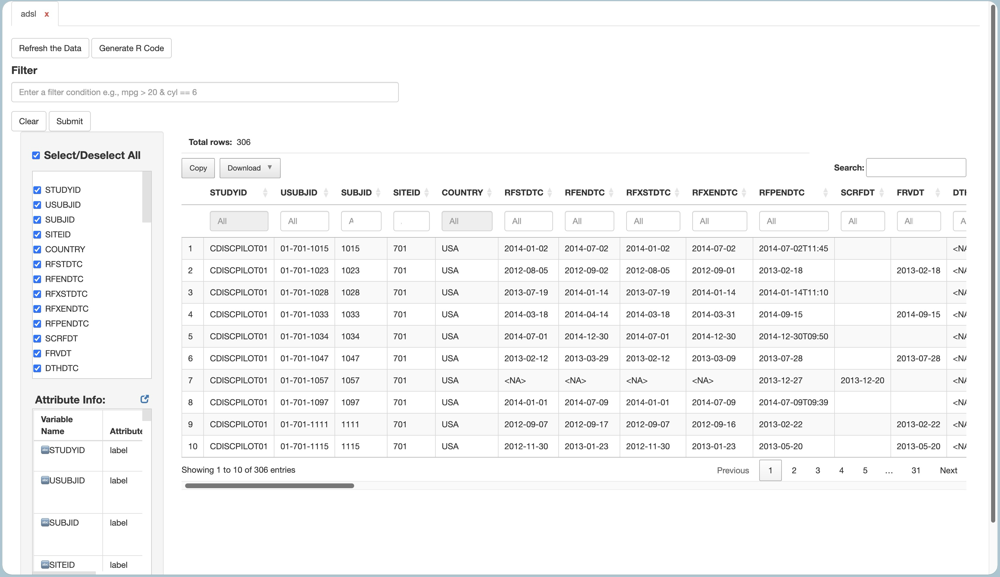
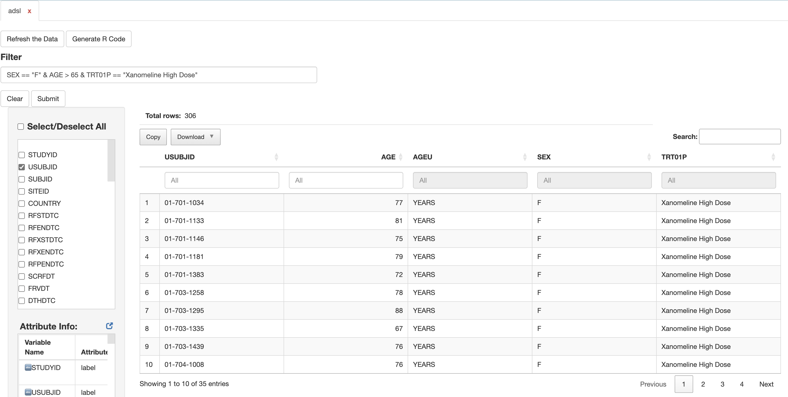
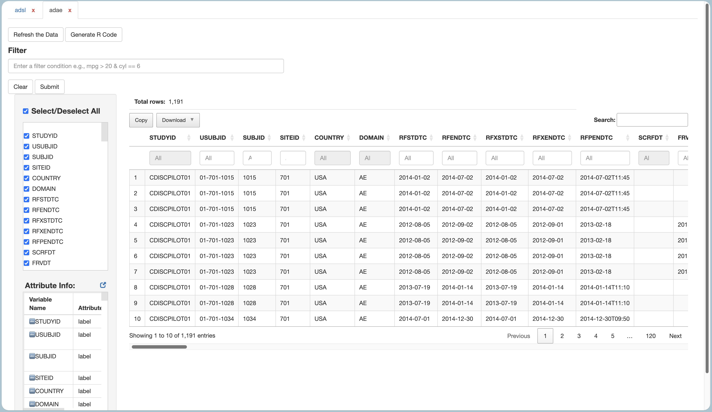
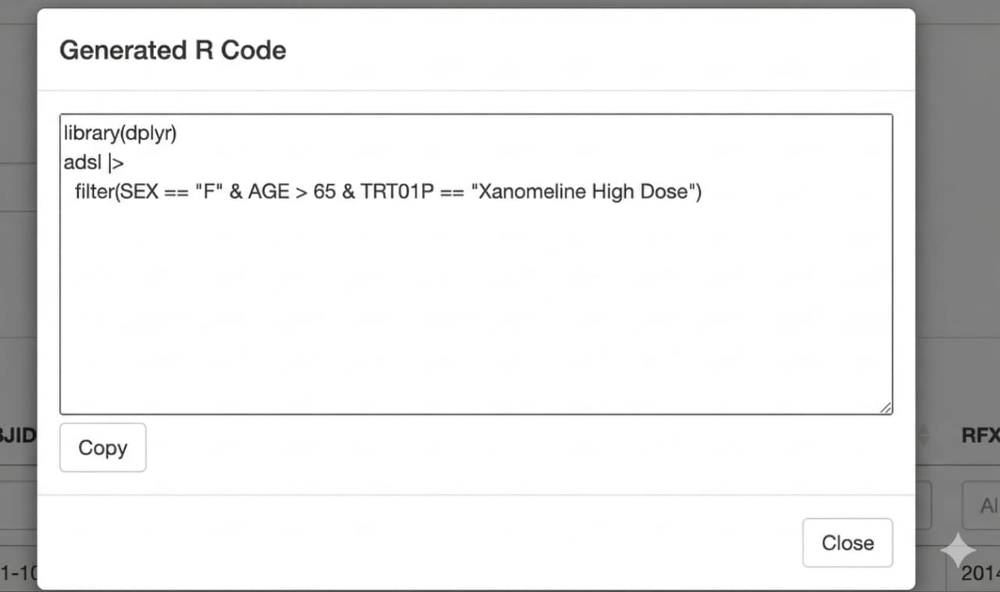
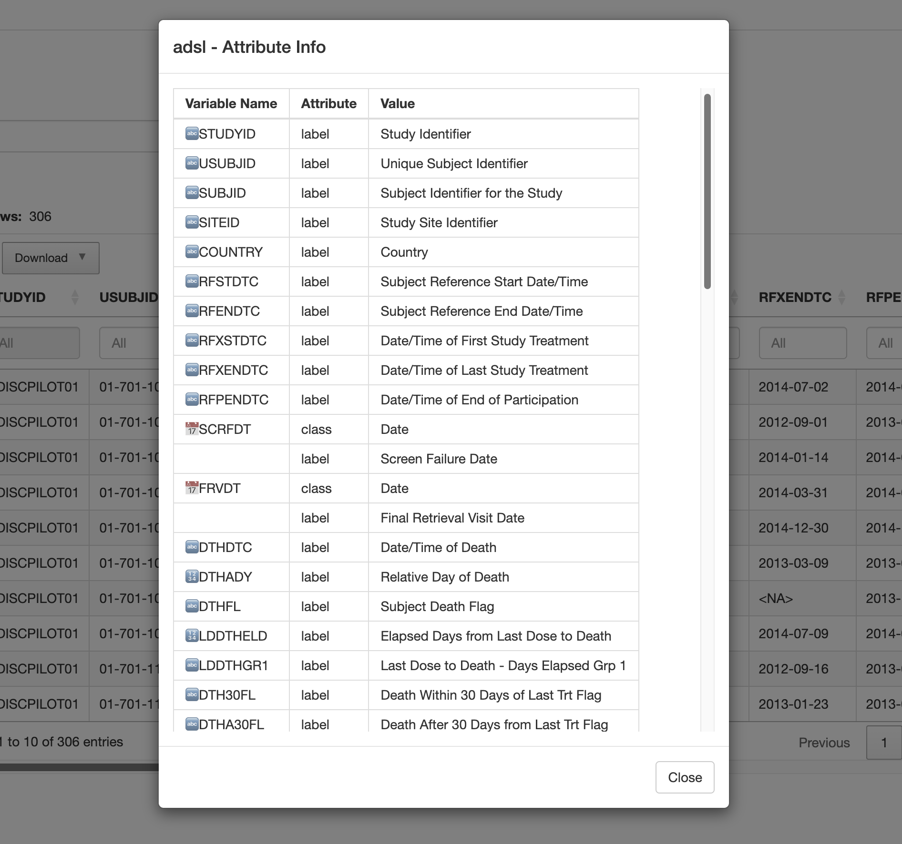

<!--------------- typical setup ----------------->

```{r setup, include=FALSE}
long_slug <- "2026-03-29-bringing-dataviewr"
```

<!--------------- post begins here ----------------->


## The humble `View()` and its limits

`View()` has served R programmers well for a long time — pass it a data
frame, get a spreadsheet-style window. It even has a basic search bar for
checking whether a value exists in your data. But the moment you need
something more precise — filter by a specific column, combine conditions,
handle `NA`s — you are back in your script.

Add to that: no side-by-side dataset comparison, no metadata inspection,
and no way to carry your exploration into reproducible code. For
day-to-day clinical data work — reviewing your clinical datasets, let's
say `ADSL`, cross-checking against `ADAE`, doing a QC pass before
analysis — these gaps add up.

**`dataviewR`** is built to extend `View()` with the interactivity clinical programmers 
actually need: column-level filtering with `dplyr` expressions, multi-dataset viewing, variable
metadata, and automatic reproducible code generation — all from a single
function call, without touching your underlying data.

```r
install.packages("dataviewR")
```

Launching the viewer requires one function call:

```r
library(dataviewR)
library(pharmaverseadam)

dataviewer(adsl)
```

`dataviewR` opens `ADSL` in an interactive table in the RStudio Viewer
pane — with filtering, column controls, metadata and export available
immediately.



## Filtering with dplyr Expressions

Where `dataviewR` meaningfully pulls ahead of `View()` is its filter
interface. The filter box accepts standard `dplyr`-style expressions —
not a custom query language, not a GUI dropdown — the same syntax
clinical programmers already use.

Launch the viewer with `ADSL`:

```r
dataviewer(adsl)
```

Then type directly into the filter box inside the app:

```r
SEX == "F" & AGE > 65 & TRT01P == "Xanomeline High Dose"
```

The table updates immediately, reflecting only the rows that match.
The filter box supports `%in%`, `is.na()`, `grepl()`, and compound
conditions — anything valid inside a `dplyr::filter()` call.



## Multi-Dataset View

Pass multiple datasets in a single call and each opens in its own tab
within the same session — no juggling separate `View()` windows.

```r
dataviewer(adsl, adae)
```



This works for any combination of datasets — useful when reviewing
SDTM and ADaM versions of the same domain, comparing pre- and
post-derivation snapshots, or cross-referencing multiple analysis
datasets during a review.

## Reproducible Code Generation

Once you have filtered and selected columns interactively, hit
**"Generate Code"** — `dataviewR` produces the equivalent `dplyr` code
ready to drop into your programme or QC script.

```r
adsl |>
  filter(SEX == "F" & AGE > 65 & TRT01P == "Xanomeline High Dose")
```



Exploration stays exploratory — the output is still code.

## Variable Metadata

Clinical datasets often carry variable attributes — labels, formats,
and classes — that are easy to lose track of during analysis. dataviewR
surfaces these directly in the app, giving you a quick view of
CDISC-style labels and variable properties without writing a single
line of code.



## Learn More

Full documentation, vignettes, and clinical dataset examples are
available at
[madhankumarnagaraji.github.io/dataviewR](https://madhankumarnagaraji.github.io/dataviewR/).
Contributions and feedback welcome on
[GitHub](https://github.com/madhankumarnagaraji/dataviewR).

```{r}
#| echo: true
#| message: false
#| warning: false

utils::packageVersion("dataviewR")
utils::packageVersion("pharmaverseadam")
```

## Disclaimer

This blog contains opinions that are of the authors alone and do not necessarily reflect the strategy of their respective organizations.