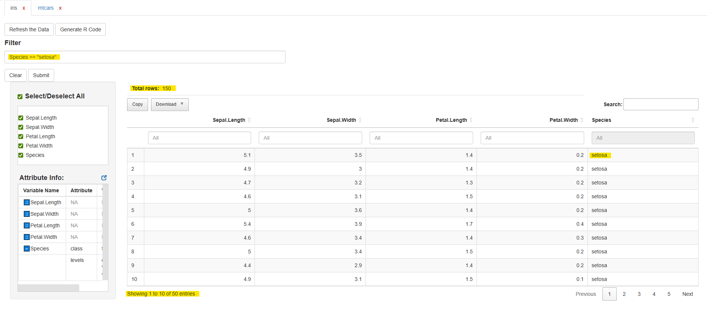
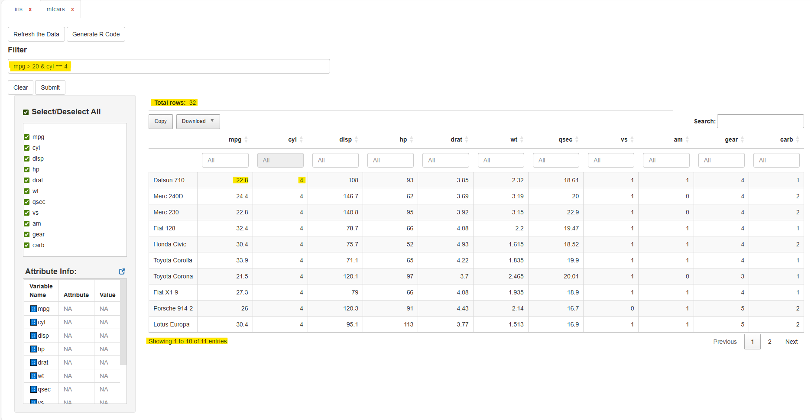

# Exploring Multiple Datasets

## Working with Multiple Datasets in dataviewR

`dataviewR` allows you to explore **two or more datasets in the same
session**, making it easy to compare structures, values, and attributes
across data sources.

This capability is especially useful when reviewing:  
- raw vs derived datasets  
- ADaM vs SDTM datasets  
- training vs test sets  
- simulation outputs vs expected results

This article walks through how to launch and work with multiple
datasets.

------------------------------------------------------------------------

### 1. Launching dataviewR with multiple datasets

You can pass any number of datasets to
[`dataviewer()`](https://madhankumarnagaraji.github.io/dataviewR/reference/dataviewer.md):

``` r
library(dataviewR)

dataviewer(iris, mtcars)
```

Each dataset will appear in its own tab inside the application in the
RStudio Viewer pane or the default web browser.

You can pass more than two datasets as well:

``` r
dataviewer(iris, mtcars, ToothGrowth, airquality)
```

### 2. Navigating between dataset tabs

Inside the Viewer pane:

- Each dataset is presented under its own labeled tab
- Switching between tabs does not reset filters or selections
- Each dataset behaves independently (filtering, column selection,
  metadata)

This makes it easy to compare side-by-side:

- variable names
- attributes (labels and classes)
- missing data patterns
- derived vs raw values

### 3. Applying filters and selections independently

Each dataset tab maintains:

- its own filter expression
- its own column selection
- its own generated code
- its own metadata panel

This allows you to:

- filter iris on species
- filter mtcars on horsepower
- compare the results

Example:

Tab: iris

``` ini
Species == "setosa"
```



Tab: mtcars

``` nginx
mpg > 20 & cyl == 4
```



Each dataset’s output, table, and code are kept separate.

### 4. Independent code generation

Click Generate R Code within any dataset tab to get a reproducible
pipeline for that dataset.

Example structure:

``` r
# Generated R Code
library(dplyr)

iris |>
  filter(Species == "setosa") |>
  select(Sepal.Length, Sepal.Width, Species)
```

Switch tabs → generate code for the other dataset.

### 5. Typical use cases

##### ✓ Raw vs Derived Data

Load both raw and derived datasets:

The dm_raw, dm, and adsl datasets are loaded from the `pharmaverseraw`,
`pharmaversesdtm`, and `pharmaverseadam` packages, respectively.

``` r
library(pharmaverseraw)
library(pharmaversesdtm)
library(pharmaverseadam)

dataviewer(dm_raw, dm)
dataviewer(dm, adsl)
```

Then:

- Compare variable labels and other attributes
- Confirm derived variables
- Check row/column mismatches

##### ✓ SDTM Dataset Review

``` r
library(pharmaversesdtm)

dataviewer(dm, suppdm, ae, suppae)
```

##### ✓ ADaM Dataset Review

``` r
library(pharmaverseadam)

dataviewer(adsl, adae, adlb)
```

Navigate through tabs to review structure and metadata.

##### ✓ Comparing train/test sets

``` r
dataviewer(train_set, test_set)
```

Inspect variable distributions and missingness.

##### ✓ Reviewing multiple simulation outputs

``` r
dataviewer(sim1, sim2, sim3)
```

Check how different simulation runs behave.

### Summary

In this article, you learned how to:

- Launch dataviewR with multiple datasets
- Navigate dataset tabs
- Filter and select columns independently
- Generate code for each dataset
- Parallel viewing of datasets in each tab

**Viewing datasets side-by-side** is one of the most powerful features
of dataviewR, especially for data review and quality control workflows.

### Next Article

Continue with: [Working with Clinical
Datasets](https://madhankumarnagaraji.github.io/dataviewR/articles/adam-clinical-dataset.md)
