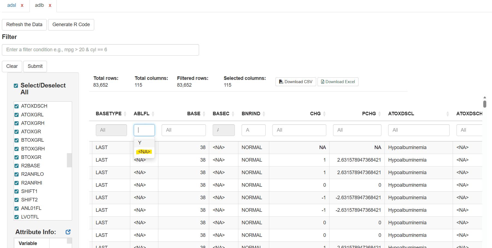
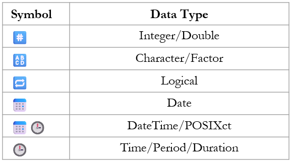

# Working with Clinical Datasets

## 1. Loading Clinical data

`dataviewR` enables efficient exploration of large clinical datasets. It
allows users to view ADaM data such as ADSL, ADAE, and ADLB along with
their corresponding SDTM datasets simultaneously, making it easier to
investigate issues in detail and ensure traceability.

User can load ADaM data like explained in the previous sections. In this
section we will be looking at how we can use `dataviewR` to explore
clinical data in detail.

## 2. Loading data and filtering data of our interest

For this section, adsl and adlb are loaded from the `pharmaverseadam`
package.

``` r
library (pharmaverseadam) 

dataviewer(adsl, adlb)
```

Users can simultaneously explore a specific subject across both ADLB and
ADSL. For example, if we want to review cholesterol values for subjects
older than 64, With `dataviewR` we can quickly explore that.

Hover to see how easily we can explore the data according to our
specific interests

## 3. Investigating missing values

In R, missing values will be represented as NA for all datatypes
(character, numeric, Date, POSIXct). Suppose user wants to explore
whether the variable (column) has missing values, for character
variables, the user can easily filter missing values from the quick
filter box (placed below the variable name) which will be visible as
**\<NA\>**. For numerical variables, the user can filter using
[`is.na()`](https://rdrr.io/r/base/NA.html) function in the Filter box.

In the below picture we can see how missing values are displayed for the
character variables in the quick filter box



## 4. Exploring metadata - vital step in clinical data

In addition to the data exploration, user can also make sure the
metadata (attributes) is correct.

For the better experience, user is requested to use the available pop-up
option next to **Attribute Info:** text.

Hover to see how easily we can explore the variable attributes in the
data

The table below lists the symbols (icons) used in dataviewR along with
their corresponding data types.



## Next article

Continue with: [Exporting data and Wrapping Up the
Session](https://madhankumarnagaraji.github.io/dataviewR/articles/Exporting-and-Reproducibility.md)
