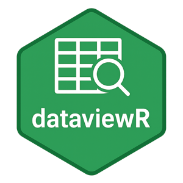
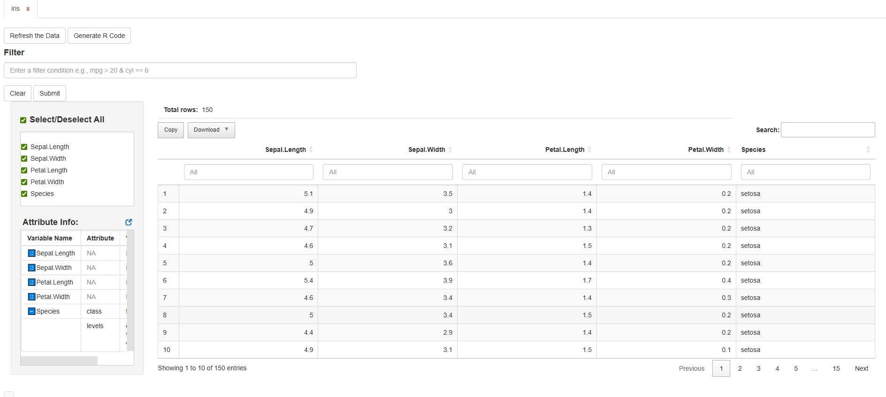
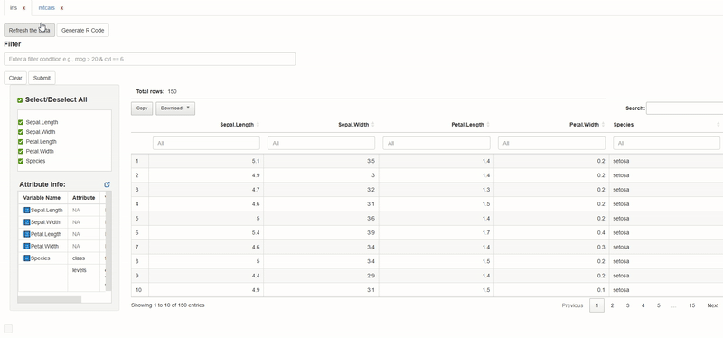

<p align="center">  </p>

```{r, include = FALSE}
knitr::opts_chunk$set(
  collapse = TRUE,
  comment = "#>"
)
```
## Introduction

dataviewR provides a clean and intuitive Shiny interface for interactively exploring R data frames and tibbles.
Instead of using the default View() utils function or writing temporary filter code, you can open a dataset visually, browse its structure, filter rows, inspect values, and export results — all within seconds.

## Why dataviewR?

Whether you’re working in data analysis, research, or learning how to handle datasets
`dataviewR` helps you:

- Inspect datasets interactively within seconds  
- Compare two or more datasets side-by-side  
- Review data quality and structure before analysis  

While functions like `View()` offer a quick static snapshot of a dataset, they are limited when working with wide tables, inspecting variable values, or applying interactive filters.

`dataviewR` offers a flexible, dynamic interface that enables efficient and intuitive data exploration, whether within the viewer tab or through a standalone R Shiny application.
 
This guide walks you through how to launch, navigate, and work with datasets in dataviewR.

For feature-specific articles and examples, visit the Articles section of the documentation.

## Launching dataviewR

There are three ways to start the application, depending on your workflow:

### 1️⃣ Launch with a dataset

When you pass a data frame, dataviewR opens directly with that dataset loaded.

To open the dataviewR shiny application user is requested to disable background option.

For better user experience it is recommended to open dataviewR in new window from Viewer tab.

```r
library(dataviewR)
dataviewer(iris) # Opens in Viewer tab

dataviewer(iris, background = FALSE) # Opens the shiny application
```

You’ll see the interactive table immediately, along with variable info and filtering options.

<p align="center">  </p>

### 2️⃣ Launch with multiple datasets (side-by-side comparison)

You can now pass two or more datasets to compare them within the same session.

```r
dataviewer(iris, mtcars)
```

This is useful for:

- comparing raw vs derived datasets

- inspecting multiple ADaM datasets

- reviewing train vs test splits

- comparing outputs across pipelines

<p align="center">  </p>

Each dataset gets its own tab, allowing you to switch seamlessly.

### 3️⃣ Launch without data (use the Import Panel)

Calling `dataviewer()` with no arguments opens the Import Panel in shiny application by default, letting you load the datasets 
either from the global environment or from the loaded packages.

```r
dataviewer()
```

Once imported, the viewer behaves the same as with built-in datasets.

<p align="center">  </p>

## What Happens Inside the App?

When a dataset is loaded, you can:

✔ Apply flexible row filters (with dplyr-style expressions) <br>
✔ Select or deselect variables and sort columns <br>
✔ See distinct values for character/factor columns (including NA) <br>
✔ View metadata such as variable classes and attributes <br>
✔ Export filtered data <br>
✔ Copy auto-generated dplyr code for reproducibility <br>

This helps integrate interactive exploration into a scripted workflow.

## Typical Workflow Example

```r
library(dataviewR)

# Explore data interactively
dataviewer(iris)
```
<!-- https://www.veed.io/edit/d97e43d9-b262-4a74-b1e7-a652dca25f2d/media -->
<p align="center" style="font-style: italic;">
  Hover to watch how dataviewR helps you explore a dataset and generate reproducible code.
</p>

<p align="center">
<video 
  src="figures/generate_R_code.mp4"
  width="85%"
  muted
  playsinline
  onmouseover="this.loop = true; this.play()"
  onmouseout="this.loop = false; this.pause(); this.currentTime = 0;">
</video>
</p>

```r
# After exploring, use the exported code:

library(dplyr)

iris |>
  filter(Species == "setosa" & Petal.Width > 0.2) |>
  select(Petal.Length, Petal.Width, Species)
```

The combination of interactive exploration + reproducible code makes dataviewR a strong addition to both analysis and QC workflows.

## Next Steps

To dive deeper into individual features, see:

- [Using Filters and Expressions](Filtering-Expressions.html)
- [Exploring Multiple Datasets](Multiple-Datasets.html)
- [Working with ADaM/Clinical Datasets](adam-clinical-dataset.html)
- [Exporting data and Wrapping Up the Session](Exporting-and-Reproducibility.html)

All available under the Articles section of the package documentation.

## Feedback

If you have suggestions or run into issues, please visit the
GitHub repository:
https://github.com/madhankumarnagaraji/dataviewR

We welcome ideas, feedback, and contributions.

🏁 That’s It!

You’re ready to start using dataviewR for fast, intuitive, and reproducible data exploration.
