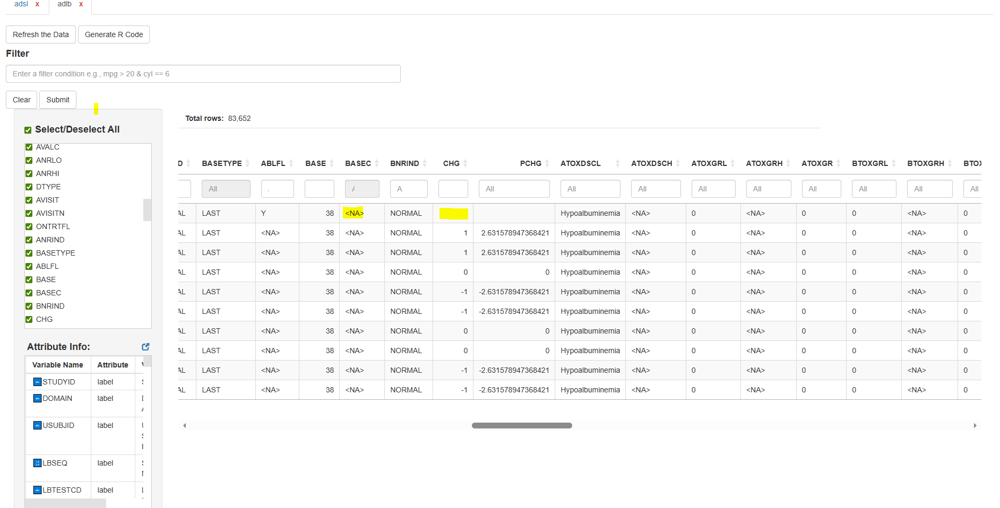

## 1. Loading Clinical data

`dataviewR` enables efficient exploration of large clinical datasets. It allows users to view ADaM data such as ADSL, ADAE, and ADLB along with their corresponding SDTM datasets simultaneously, making it easier to investigate issues in detail and ensure traceability.

User can load ADaM data like explained in the previous sections. In this section we will be looking at how we can use `dataviewR` to explore clinical data in detail.

## 2. Loading data and filtering data of our interest

For this section, adsl and adlb are loaded from the `pharmaverseadam` package.

```r
library (pharmaverseadam) 

dataviewer(adsl, adlb)
```
Suppose we want to examine safety population subjects with high hemoglobin and review how their hemoglobin values were recorded. With `dataviewR`, this can be done within seconds.

<p align="center" style="font-style: italic;">
  Hover to see how easily we can explore the data according to our specific interests
</p>

<p align="center">
<video 
  src="figures/adlb1_c.mp4"
  width="85%"
  muted
  playsinline
  onmouseover="this.loop = true; this.play()"
  onmouseout="this.loop = false; this.pause(); this.currentTime = 0;">
</video>
</p>

Users can simultaneously explore a specific subject across both ADLB and ADSL. For example, if we want to review cholesterol values for subjects older than 64, With `dataviewR`  we can quickly explore that.

<p align="center" style="font-style: italic;">
 Hover to see how easily we can explore the data according to our specific interests
</p>

<p align="center">
<video 
  src="figures/adlb2_c.mp4"
  width="85%"
  muted
  playsinline
  onmouseover="this.loop = true; this.play()"
  onmouseout="this.loop = false; this.pause(); this.currentTime = 0;">
</video>
</p>

## 3. Investigating missing values
In R, missing values will be represented as NA for all datatypes (character, numeric, date, posixct). Suppose user wants to explore whether the variable (column) has missing values, for character variables user can easily filter missing values from the quick filter box (placed below the variable name) which will be visible as **\<NA>**. For numerical variables it is displayed as blank cell (as per DT package formatting), which cannot be filtered from quick filters in the current version.

<p align="center" style="font-style: italic;">
  In the below picture we can see how missing values are displayed for the character variables in the quick filter box
</p>
<p align="center">  </p>

<p align="center" style="font-style: italic;">
 In the below picture we can see missing values for numeric variables are displayed
</p>
<p align="center">  </p>

## 4. Exploring metadata - vital step in clinical data

In addition to the data exploration, user can also make sure the metadata (attributes) is correct.

For the better experience, user is requested to use the available pop-up option next to **Attribute Info:** text.

<p align="center" style="font-style: italic;">
 Hover to see how easily we can explore the variable attributes in the data
</p>

<p align="center">
<video 
  src="figures/adlb3_c.mp4"
  width="85%"
  muted
  playsinline
  onmouseover="this.loop = true; this.play()"
  onmouseout="this.loop = false; this.pause(); this.currentTime = 0;">
</video>
</p>

## Next article

Continue with: [Exporting data and Wrapping Up the Session](Exporting-and-Reproducibility.html)
